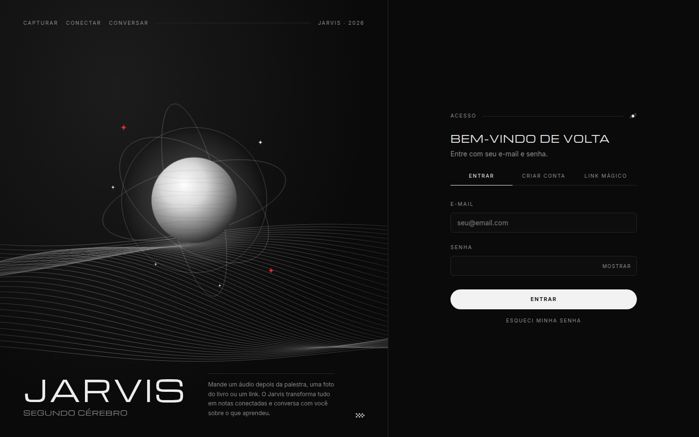
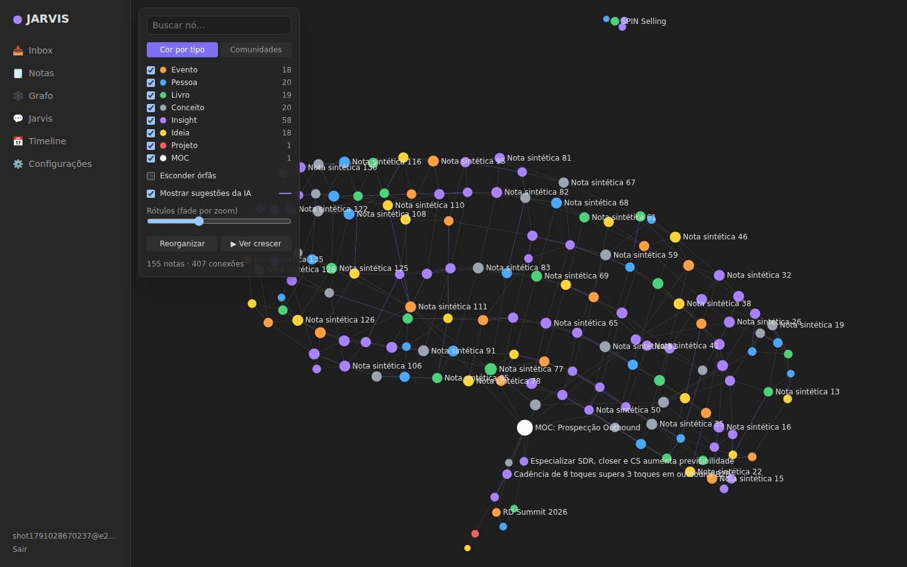

# JARVIS — segundo cérebro com IA e grafo estilo Obsidian

Mande o que você aprende (áudio depois de uma palestra, foto de página de livro, link, ideia) pelo Telegram ou
pela web. O JARVIS transforma cada entrada em **notas atômicas conectadas**, mostra tudo num **grafo** e
**conversa** com a sua base, inclusive de dentro do Claude Code via **MCP**.

**Stack:** Next.js 16 · Supabase (Postgres, pgvector, pgmq, pg_cron, Storage, Auth, RLS) · Claude (Haiku 4.5 na
ingestão, Sonnet 5.5 no chat) · OpenAI (embeddings + transcrição) · Sigma.js + Graphology · Vercel.





## O que já funciona
- **Captura**: bot do Telegram (texto, voz, foto, link, PDF) com pareamento por código, `/evento`, `/livro`,
  `/fim` e `/p <pergunta>`. Também há captura pela web (texto, link e upload).
- **Pipeline**: normalização (transcrição, vision, PDF, artigo), extração estruturada, entity resolution
  (reusar/perguntar/criar), notas atômicas com proveniência, links tipados, embeddings automáticos e sugestão de
  links semânticos com relação e justificativa. Usa fila pgmq com retry e é idempotente.
- **Cérebro** (home): grafo em tela cheia no estilo do Obsidian — clique num ponto para abrir o painel da nota (ler, editar, conexões por relação, sugestões da IA, arquivos, grafo local); painel flutuante com Filtros · Grupos · Exibição · Forças.
- **Barra de comando** (Ctrl/Cmd+K, ou o botão +): captura uma ideia/link/arquivo, busca notas, pula para um nó e pergunta ao Jarvis. Arquivos de até 50 MB podem ser soltos em qualquer tela.
- **Notas · Timeline · Arquivos**: lista à esquerda + leitura à direita. **Revisar (N)**: gaveta com sementes, conexões sugeridas e decisões pendentes. **Jarvis**: dock de chat (tecla J) com citações clicáveis.
- **Notas**: editor markdown com `[[wikilinks]]`, backlinks, fontes e notas relacionadas por semântica.
- **Grafo**: WebGL, cor por tipo ou comunidade, tamanho ∝ √grau, fade de rótulos, hover na vizinhança, filtros,
  "ver o cérebro crescer", foco numa nota, layout ForceAtlas2 com posições salvas.
- **Jarvis**: chat com streaming e tools (busca híbrida RRF + vizinhança no grafo, timeline, criar/ligar notas,
  memória), perfil cacheado e citações `[[Título]]`.
- **MCP**: as mesmas 11 tools num servidor MCP remoto (`/api/mcp`, token por workspace).
- **Lint semanal**: duplicatas, órfãs, clusters sem MOC e lembrete de sementes antigas no Telegram.
- **Brief** diário e semanal no Telegram (e `/brief` sob demanda): o que você aprendeu, conexões e uma sugestão de ação.
- **Fontes longas** (livros, transcrições de 1 h): chunks com embedding para o Jarvis citar trechos literais.
- **Memória episódica**: cada conversa com o Jarvis vira um resumo pesquisável.
- **Backup**: exportação completa para um vault do Obsidian (.zip) em Configurações.
- **Editor** com autocomplete ao digitar `[[`.
- **Multiusuário desde o dia 1**: `workspace_id` + RLS em tudo, uso de IA registrado por workspace.

## Rodando localmente
```bash
pnpm install
npx supabase start                # Postgres + Auth + Storage locais (Docker)
npx supabase db reset             # aplica migrations + seed
cp .env.example apps/web/.env.local   # preencha com `npx supabase status` e suas chaves
pnpm dev                          # http://localhost:3000
```
O app abre direto, sem login (uso interno); com `JARVIS_REQUIRE_LOGIN=1` passa a exigir e-mail e senha (ou link mágico). No Supabase local, os e-mails ficam no Mailpit (`supabase status` mostra a URL).
Para ver os dados do seed, associe seu usuário ao workspace de exemplo (instruções no topo de `supabase/seed.sql`).

## Testes
| Comando | O que cobre |
|---|---|
| `pnpm test` | core (taxonomia, wikilinks, entity resolution, plano de ingestão) + web (Telegram, MCP, markdown/XSS, normalização, eval) |
| `psql "$DB_URL" -f supabase/tests/rls_and_functions.sql` | RLS/isolamento, busca híbrida em PT, grafo, timeline, filas, imutabilidade, lint, merge |
| `pnpm --filter web test:e2e` | e2e (18 passos) com app + Supabase local + mocks (Telegram/Anthropic/OpenAI): pareamento → captura → notas → embeddings → fonte longa → brief → chat → memória → exportação → MCP → isolamento |
| `pnpm eval:ingest` | golden set de extração (10 capturas reais de exemplo) com modelo de verdade |

## Documentação
- [`docs/PRD.md`](docs/PRD.md): visão, requisitos e estado por fase
- [`docs/ARCHITECTURE.md`](docs/ARCHITECTURE.md): diagrama, fluxo e ADRs
- [`docs/TAXONOMY.md`](docs/TAXONOMY.md): tipos, relações e regras de atomização
- [`docs/ROADMAP.md`](docs/ROADMAP.md): checklist de deploy e próximos passos
- [`docs/DEPLOY.md`](docs/DEPLOY.md): estado atual do deploy (Supabase no ar, pendências da Vercel)
- [`CLAUDE.md`](CLAUDE.md): contexto permanente para o Claude Code (+ `.claude/agents` e `.claude/skills`)
